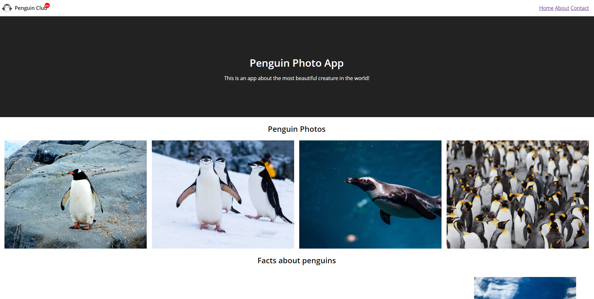

# WEEKLY INTERMEDIATE ASSIGNMENT 3

Greetings World, for this week assignment we (Revou FSSE Students) are tasked with making a more advanced website that requires **HTML** and **CSS** with advanced frontend technique

The task required a few skillset such as:
- Building a webpage and try to use the correct semantics for each element
- Applying Responsive Web Design (RWD) with media querry
- Creating a form set that includes input type text, textarea, submit button, and one of the radion buttons, checkboxes, or select
- Centering element using Flex
- Creating a sticky navigation header

For this website I made some features that should help me fulfill the skillset, such ass:
1. Applying custom font using @font-face
2. Applying text-shadow to text
3. Applying 1 responsive image with **picture + source + srcset** method
4. Creating one asymmetrical grid
5. Using at least **one** advanced form element
6. Create simple animation with **animation** and **transition**

My website is a homage to the Galactic Empire and all of its member, such as all kinds of troopers and our great leader Darth Vader. On my website you can Enlist yourself to the great Galactic Empire, come join us!

The preview of the example website is shown as below

Meanwhile this is the link to my results 
[Click Me!](https://rayhanzou-week3-assignment.netlify.app)
